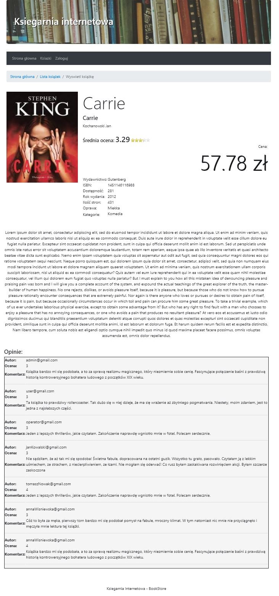
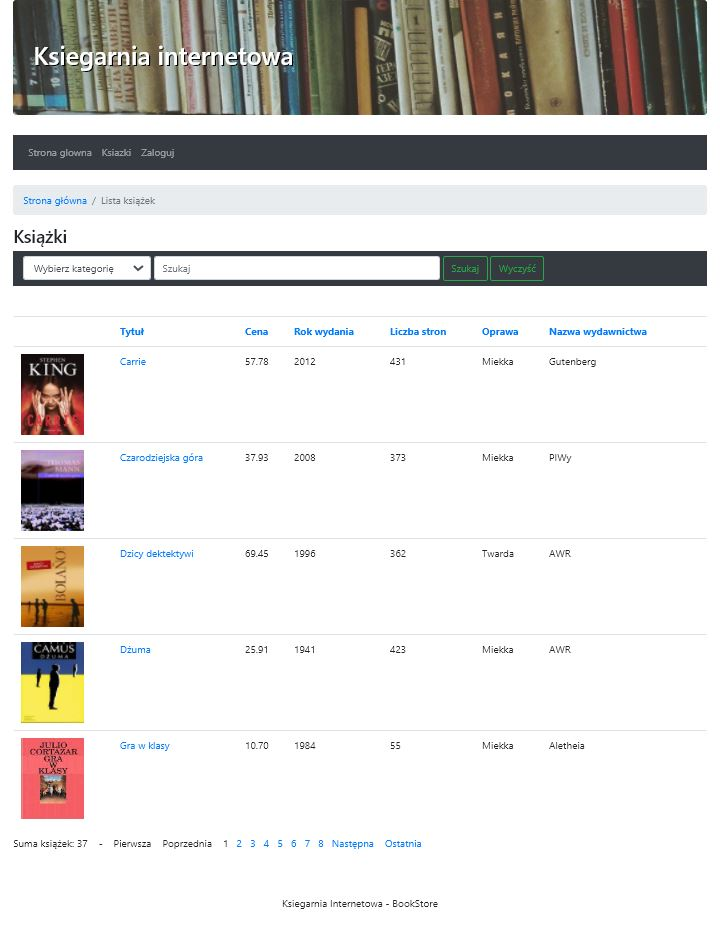
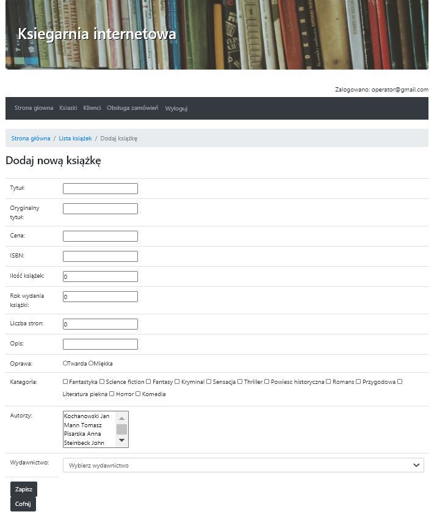
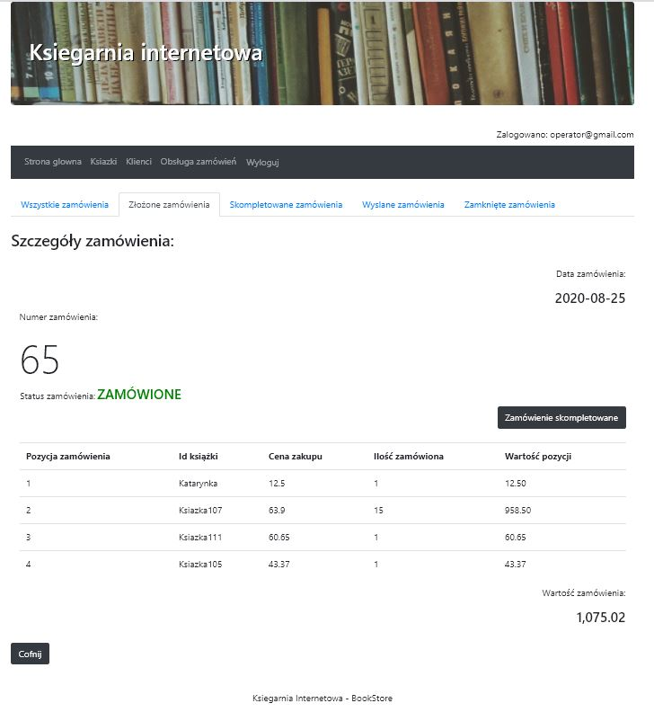

# BookStore
Spring Boot web application with Spring MVC, Thymeleaf, JPA, Hibernate and Oracle Database.

### Sample screenshot(Information about a book and comments):

### Sample screenshot(Searching and selecting books):

### Sample screenshot(Adding new book):

### Sample screenshot(Orders):

### Sample screenshot(Order details):

